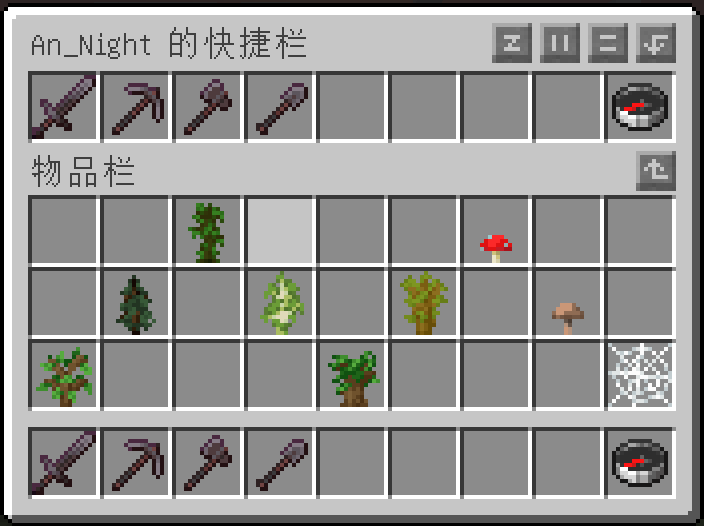
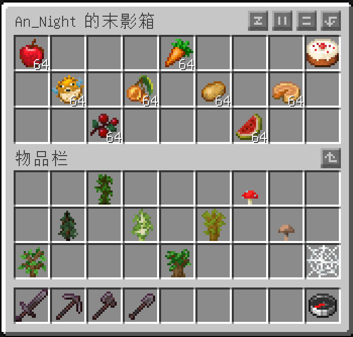
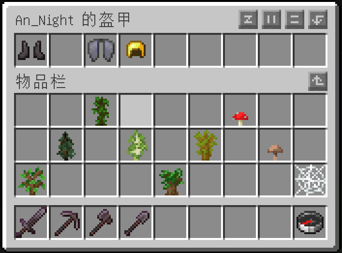
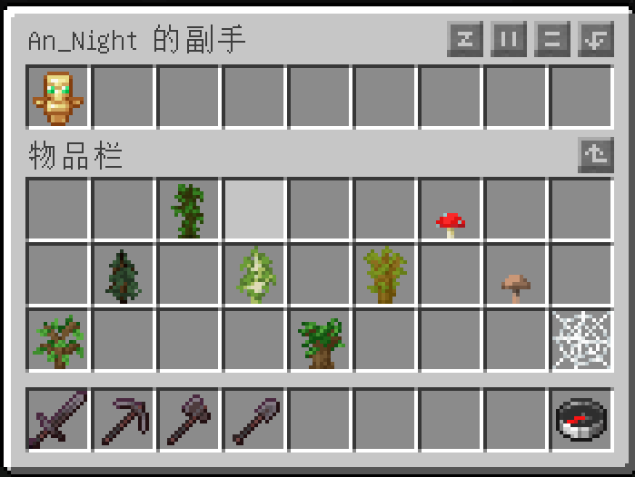

# Slots Checker

## 简介
这是一个基于Fabric的Minecraft游戏模组，为管理员提供了一组“/slots-checker”命令，以查看并修改任意玩家的背包（inventory）、快捷栏（hotbar）、末影箱（ender）、盔甲（armor）和副手（offhand）物品槽。  
注意：**服务端必装**，客户端选装。客户端安装后可提供少量翻译。

## 下载
|文件名|MC版本|Fabric版本|前置mod|备注|
|---|---|---|---|---|
|[slots-checker-mc1.19.2-server0.14.9-api0.60.0-1.0.jar](https://pan.baidu.com/s/1EH1Zj-yCtzkwLop2x3JjpQ?pwd=o2hb)|1.19.2|0.14.9+|fabric-api-0.60.0+1.19.2.jar|低fabric版本支持|
|[slots-checker-mc1.19.2-server0.14.13-api0.73.0-1.0.jar](https://pan.baidu.com/s/1TiGdxntyAExpe3tuQFADFA?pwd=bqh2)|1.19.2|0.14.13+|fabric-api-0.73.0+1.19.2.jar||
|[slots-checker-mc1.18.2-server0.14.12-api0.67.0-1.0.jar](https://pan.baidu.com/s/1BtAn8XJMeq98nQ1AYQL9iA?pwd=9vrf)|1.18.2|0.14.12+|fabric-api-0.67.0+1.18.2.jar||

## 命令
1. `/slots-checker inventory <玩家>`  
    打开玩家的背包界面。  
    

2. `/slots-checker hotbar <玩家>`  
    打开玩家的快捷栏界面。  
     

3. `/slots-checker ender <玩家>`  
    打开玩家的末影箱界面。  
     

4. `/slots-checker armor <玩家>`  
    打开玩家的盔甲槽界面。  
    前 4 个栏位依次为：靴子、护腿、胸甲、头盔；后 5 个栏位**无效**。  
    此界面**没有**物品限制，任意物品均可直接放入盔甲栏位。  
     

5. `/slots-checker offhand <玩家>`  
    打开玩家的副手槽界面。  
    后 8 个栏位**无效**。  
     

## 协议
MIT

## 关于
作者：廖浩龙

Email1 : aliaohaolong@qq.com  
Email2 : aliaohaolong@gmail.com