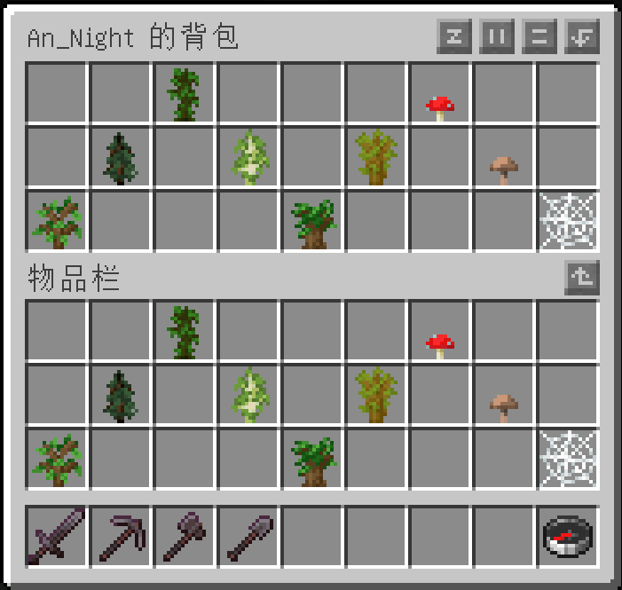
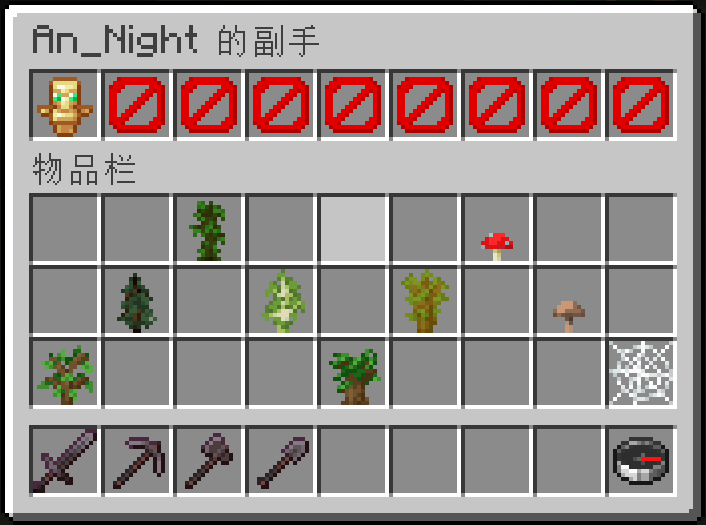

# Slots Checker

[[English]](Readme.en.md)

Modrinth：  
[Slots Checker - Minecraft Mod](https://modrinth.com/mod/slots-checker)

Mod 百科：  
[Slots Checker - MC百科|最大的Minecraft中文MOD百科](https://www.mcmod.cn/class/8936.html)

源码：  
[Gitee.com - 暗夜/Slots Checker](https://gitee.com/AnNight/slots-checker)

报告问题：  
[Issues · 暗夜/Slots Checker - Gitee.com](https://gitee.com/AnNight/slots-checker/issues)

Wiki：  
[Wiki - Gitee.com](https://gitee.com/AnNight/slots-checker/wikis)

## 介绍

这是一个基于Fabric的Minecraft游戏模组，为管理员提供了一组“/slots-checker”命令，以查看并修改任意玩家的背包（Inventory）、快捷栏（Hotbar）、末影箱（Ender Chest）、盔甲（Armor）和副手（Offhand）物品槽。

客户端安装后可提供游戏内界面翻译。支持 en_us、zh_cn、zh_hk 和 zh_tw 语言。

注意事项：

- **服务端必装，客户端选装。**
- 暂**不支持**查看和修改离线玩家的数据（离线玩家指的是当前不在游戏内的玩家，而不是指通过离线登陆方式进入游戏的玩家）。
- [创造模式背包问题](CreativeInventoryProblem.md)

## 命令

1. `/slots-checker inventory <玩家>`  
    打开玩家的背包界面。  
    

2. `/slots-checker hotbar <玩家>`  
    打开玩家的快捷栏界面。  
     

3. `/slots-checker ender <玩家>`  
    打开玩家的末影箱界面。  
     

4. `/slots-checker armor <玩家>`  
    打开玩家的盔甲槽界面。  
    前 4 个栏位依次为：靴子、护腿、胸甲、头盔；后 5 个栏位无效。  
    此界面没有物品限制，任意物品均可直接放入盔甲栏位。  
     

5. `/slots-checker offhand <玩家>`  
    打开玩家的副手槽界面。  
    后 8 个栏位无效。  
    

## 作者

廖浩龙

- aliaohaolong@qq.com  
- aliaohaolong@gmail.com

## 开源协议

- 当前版本（v2 起）：开源，采用 [Apache License 2.0](LICENSE) 协议。
- 历史版本（v1 及之前）：闭源开发，曾声明 MIT 协议但未公开源码。
